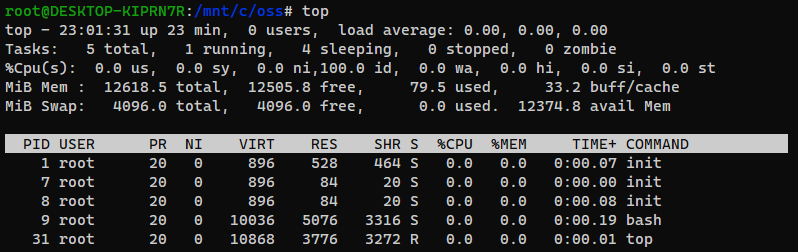
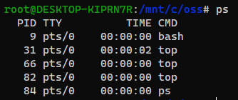
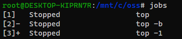
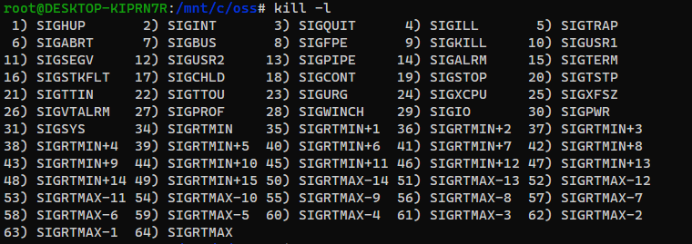
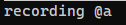

# 220605 oss_assignment2
 INTRODUCTION TO OPEN SOURCE SW 두 번째 과제입니다.  

### 목차  
1. [리눅스 명령어](#리눅스-명령어)  
1.1. [top](#1-top)  
1.2. [ps](#2-ps)  
1.3. [jobs](#3-jobs)  
1.4. [kill](#4-kill)  
2. [vim 에디터 매크로 활용방법](#vim-에디터-매크로-활용방법)  

## 리눅스 명령어
### 1. top
Linux 명령어 `top`은 실시간으로 실행 중인 프로세스를 보여주며 커널 관리 작업을 표시한다. 또한 CPU 및 메모리 사용량을 포함한 정보도 함께 표시한다.  

아래의 사진은 top 명령어를 입력한 결과 사진이다.  
  
**Line 1** : System time, Uptime, User 및 load 평균  
**Line 2** : Tasks 정보, process 상태    
**Line 3** : CPU 사용량, 모든 값의 총합은 100%  
(us : 유저 영역의 CPU 사용률, sy : 커널 영역의 CPU 사용률, ni : 낮은 우선 순위 프로세스에 보낸 CPU 사용률, id : idle CPU 비율, wa : IO가 완료될 때까지 기다리고 있는 CPU 비율, hi : 하드웨어 interrupts에 사용되는 CPU 사용률, si : 소프트웨어 interrupt에 사용되는 CPU 사용률, st : CPU를 VM에서 사용하여 대기하는 CPU 비율)  
**Line 4~5** : Memory 사용량(Line 4 (Mem) : RAM 메모리 공간, Line 5 (Swap) : Swap 메모리 공간  
**Line 6**  
1. PID : 프로세스 ID  
2. USER : 실행한 USER 이름
3. PR : 스케줄링 되는 우선순위  
4. NI : nice 값  
5. VIRT : 가상메모리 사용량  
6. RES : resident 메모리   
7. SHR : 공유메모리  
8. S : 프로세스 현재 상태  
9. %CPU : CPU 사용량
10. %MEM : 메모리 사용량  
11. TIME+ : 가동시간  
12. COMMAND : 해당 프로세스를 실행한 command  

* ### top 명령어 옵션
|옵션|설명|
|---|-----|
|-a|메모리 사용에 따라 정렬|
|-b|Batch mode, 배치 모드에서 시작|
|-c|Toggle command line/program name, 명령어 라인을 보여준다|
|-d [N]|Delay time interval, 화면 갱신 시간 설정|
|-h|Help, 도움말|
|-H|Threads mode operation, 모든 개별 threads 출력|
|-i|Idle process toggle, 좀비(zombie) 또는 Idle 상태 무시|
|-n|Limit iteration number, 실행주기 설정|
|-p [PID]|특정 프로세스만 출력|
|-s|Secure mode operation, 보안 모드|
|-S|Cumulative time toggle, 누적 시간 toggle이 On일 경우 각 프로세스가 CPU를 사용한 시간과 함께 출력|
|-u [ID or name]|지정된 유효 사용자에 의한 프로세스만 출력|
|-U [ID or name]|지정된 사용자에 의한 프로세스만 출력|
|-v|version, 라이브러리 버전 출력|

* ### top 실행 중 명령어
|키|설명|
|---|-----|
|space bar|Refresh|
|k|kill, process 종료|
|r|nice, 우선순위 값 변경|
|c|명령 인자 on/off|
|l|첫 번째 행 on/off|
|t|Task 항목 on/off|
|m|CPU 상황 on/off|
|n|출력할 프로세스 개수 설정|
|u|입력한 유저의 프로세스만 출력|
|i|좀비(zombie) 또는 Idle 상태 무시|
|d|Refresh 간격 조절|
|Z|출력 색상 변경|
|q|top 종료|

**정렬**
|키|정렬 기준 column|설명|
|---|-----|-----|
|M|%MEM|memory usage로 정렬|
|P|%CPU|CPU usage로 정렬|
|N|PID|process ID로 정렬|
|T|TIME+|running time으로 정렬|
|R||오름차순 내림차순 변경|

### 2. ps
Linux 명령어 `ps`는 현재 실행 중인 프로세스 목록을 보여주는 명령어이다.  

아래의 사진은 ps 명령어를 입력한 결과 사진이다.  
  
**설명**  
1. PID : 프로세스 ID    
2. TTY : 터미널  
3. TIME : CPU 점유 시간    
4. CMD : 프로세스가 수행한 명령어  

ps 명령어는 `ps -efl` 처럼 주로 **옵션과 함께 사용**된다.

ps의 옵션은 세 가지 유형으로 나눠진다.  
1. UNIX : 단일 대시(-)가 앞에 온다.
2. BSD : 대시 없이 사용된다.
3. GNU : 두 개의 대시(--)가 앞에 온다.  

### ps 명령어 옵션
|옵션|설명|
|---|-----|
|-A|모든 프로세스 출력|
|a (BSD)|터미널과 연관된 프로세스 출력|
|-a|세션 리더와 터미널과 연관된 프로세스를 제외한 프로세스 출력|
|-d|세션 리더를 제외한 모든 프로세스 출력|
|-e|실행 중인 모든 프로세스 출력|
|-f|full format으로 출력, ppid 확인 가능|
|-l|long format으로 출력|
|-o|출력 column 지정, 사용자가 format 지정|
|-p|특정 PID의 프로세스 출력|
|--ppid|부모 프로세스 id와 일치하는 프로세스 출력|
|-t|tty와 일치하는 프로세스 출력|
|u (BSD)|사용자 정보 출력, 사용자 지향 형식|
|-u|특정 사용자의 프로세스 정보 출력|
|x (BSD)|터미널에 종속되지 않는 프로세스 출력|
|-x|로그인 상태에 있는 동안 아직 완료되지 않은 프로세서 출력|
|--help|도움말|

`ps -ef | grep root`  
위와 같이 파이프(|)를 통해 다른 명령어와 함께 사용 가능하며 grep으로 원하는 프로세스만 필터링이 가능하다.  
BSD 계열에서는 `ps aux`를 많이 사용한다. `ps aux`는 시스템에 동작 중인 모든 프로세스를 소유자 정보와 함께 출력한다.

### 3. jobs
Linux 명령어 `jobs`는 백그라운드에 실행되고 있거나 현재 중지된 프로세스를 보여주는 명령어이다.  

아래의 사진은 jobs 명령어를 입력한 결과 사진이다.  
   
**설명**  
1. job 번호 : 첫 번째 열의 숫자
2. jobs 기호 : +, - 기호 (+: 현재 job)
3. jobs 상태 : job의 상태 (Running: 실행중, Stopped: 작업 일시중단, done: 작업 종료)
4. jobs : job

### jobs 명령어 옵션
|옵션|설명|
|---|-----|
|-l|프로세스 ID를 추가로 출력|
|-n|마지막 알림 이후 상태가 변경된 프로세스 출력|
|-p|각 프로세스 ID만 한 행씩 출력|
|-r|실행 중인 작업만 출력|
|-s|중지된 작업만 출력|

### 4. kill
Linux 명령어 `kill`은 프로세스에 signal을 보내는 명령어이다.

아래의 사진은 `kill -l`을 입력한 결과 사진이다. `kill -l`은 signal의 종류를 출력한다.

### kill 명령어 옵션  
|옵션|설명|
|---|-----|
|-s sig|SIG는 signal name|
|-n sig|SIG는 signal number|
|-l|signal list 출력|

**signal**
|signal 번호|signal 이름|설명|
|---|-----|-----|
|1|SIGHUP|연결 끊기|
|2|SIGINT|interrupt|
|3|SIGQUIT|종료|
|4|SIGILL|잘못된 명령|
|5|SIGTRAP|TRAP 추적|
|7|SIGBUS|BUS 에러|
|8|SIGFPE|고정 소수점 예외|
|9|SIGKILL|죽이기|
|10|SIGUSR1|사용자 정의 시그널1|
|11|SIGSEGV|Segmentation 위반|
|12|SIGUSR2|사용자 정의 시그널2|
|13|SIGPIPE|읽을 것이 없는 파이프에 대한 시그널|
|14|SIGALRM|경고 clock|
|15|SIGTERM|소프트웨어 종료|
|16|SIGTKFLT|프로세서 스택 실패|
|17|SIGCHLD|자식 프로세스의 상태변화|
|18|SIGCONT|Continue|
|19|SIGSTOP|정지|
|20|SIGTSTP|키보드에 의해 발생하는 시그널|
|21|SIGTTIN|백그라운드에서 tty 읽기|
|22|SIGTTOU|백그라운드에서 tty 쓰기
|23|SIGURG|socket의 긴급한 상태|
|24|SIGXCPU|CPU 시간제한 초과|
|25|SIGXFSZ|파일 크기 제한 초과|
|26|SIGVTALRM|가상 시간 경고|
|27|SIGPROF|프로파일링 타이머 경고|
|28|SIGWINCH|윈도우 사이즈 변경|
|29|SIGIO|기술자에서 입출력 가능|
|30|SIGPWR|전원 실패|

## vim 에디터 매크로 활용방법
### 매크로란?
특정한 움직임 또는 입력을 키에 저장하여 단순 반복되는 동작을 쉽고 빠르게 할 수 있게 해주는 것이다.  

**매크로 사용 순서**  
1. `q[Name]` : 매크로 기록 시작  
2. 매크로에 기록할 동작  
3. `q` : 매크로 기록 종료  
4. `@[Name]` : 매크로 실행  

* ### 매크로 기록 방법  
vim 일반모드에서 q를 누른 다음 매크로 이름으로 사용할 알파벳을 지정한다. 형식은 `q[Name]`과 같다. 예를 들어 `qa`라고 입력한 경우 a라는 이름의 매크로를 기록하기 시작한다.  
  
qa를 입력해 매크로 기록이 시작되면 아래쪽에 사진과 같이 `recording @a` 라고 나온다. 매크로로 기록하고 싶은 것을 기록한 후 다시 q를 입력하면 매크로 기록이 종료된다.  

* ### 매크로 실행 방법  
매크로를 실행하는 방법은 vim 일반모드에서 `@[Name]`을 입력하면 된다. 위의 설명처럼 매크로 이름을 a라고 지정했을 경우 매크로를 재생할 때 `@a`를 입력하면 매크로가 재생된다.  
`[숫자]@[Name]`의 경우 숫자만큼 매크로를 반복 실행하며, `@@`은 가장 마지막에 실행한 매크로가 다시 재생된다.  
