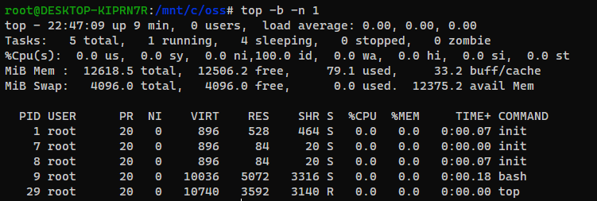

# 220605 oss_assignment
 오픈소스SW개론 두 번째 과제입니다.  
  
  
 ### 목차  
 [1. 리눅스 명령어](#리눅스-명령어-top,-ps,-jobs,-kill)  
 [2. vim 에디터 매크로 활용방법](#vim-에디터-매크로-활용방법)  
  
  

## 리눅스 명령어 top, ps, jobs, kill
### 1.top

### 2.ps

### 3.jobs

### 4.kill

## vim 에디터 매크로 활용방법
